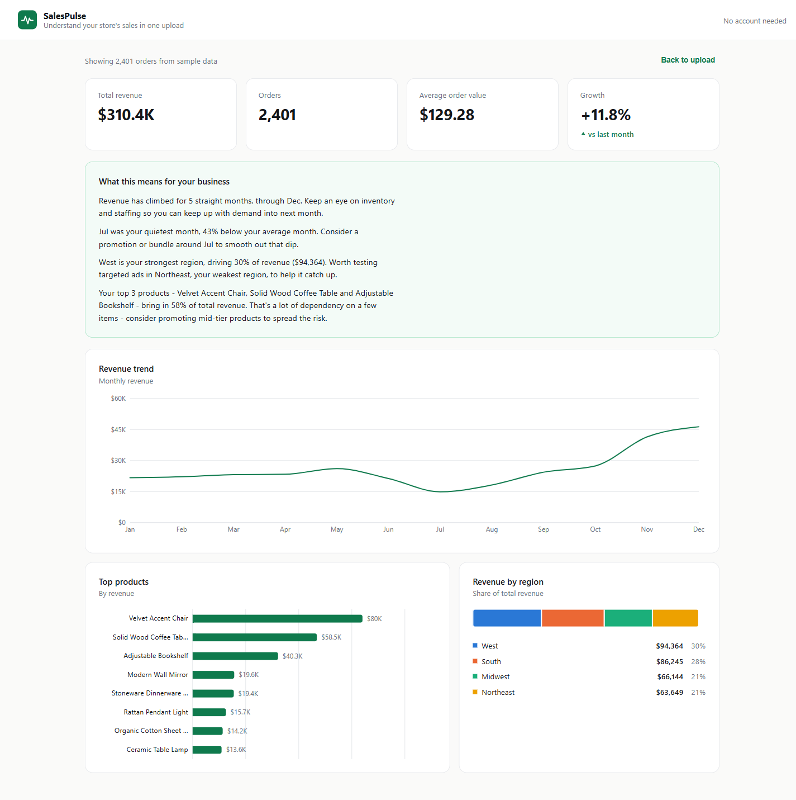

# SalesPulse

SalesPulse turns a raw orders CSV into a clean, client-ready sales dashboard in seconds. Drop in an export from Shopify, WooCommerce, or a spreadsheet, and it surfaces revenue, growth, top products, and regional performance, along with plain-English insights about what's actually happening in the business, no login, no database, no setup.



## Live demo

[salespulse.example.com](https://salespulse.example.com) *(placeholder — update once deployed)*

## Features

- **Flexible CSV upload** — drag-and-drop or browse; recognizes common header variations (`date`/`order date`, `amount`/`total`/`revenue`, `product`/`item`, `region`/`state`, and more), so most order exports work without reformatting
- **KPI cards** — total revenue, order count, average order value, and month-over-month growth with a directional indicator
- **Revenue trend chart** — 12-month line chart of monthly revenue
- **Top products chart** — horizontal bar chart of the top 8 products by revenue
- **Revenue by region** — stacked breakdown of revenue share across regions
- **Auto-generated insights** — a rule-based panel that reads the loaded data and writes out observations (slowest month, revenue concentration, strongest region, growth trajectory) with a recommended next action for each, computed entirely client-side
- **Friendly error handling** — clear messages for missing columns, empty files, or unreadable CSVs, with a one-click reset back to upload
- **Sample data included** — try the full dashboard instantly, or download a 20-row example CSV to see the expected format

## Tech stack

- [React 18](https://react.dev/) + [Vite](https://vitejs.dev/)
- [Recharts](https://recharts.org/) for charts
- [PapaParse](https://www.papaparse.com/) for CSV parsing
- Plain CSS, no UI framework — runs fully offline after install

## Running locally

```bash
npm install
npm run dev
```

Then open the local URL Vite prints (typically `http://localhost:5173`).

To build a production bundle:

```bash
npm run build
```
